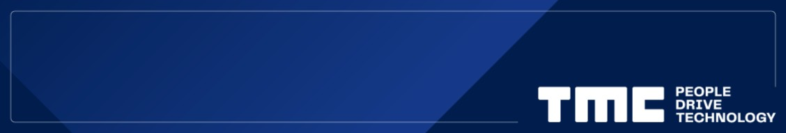
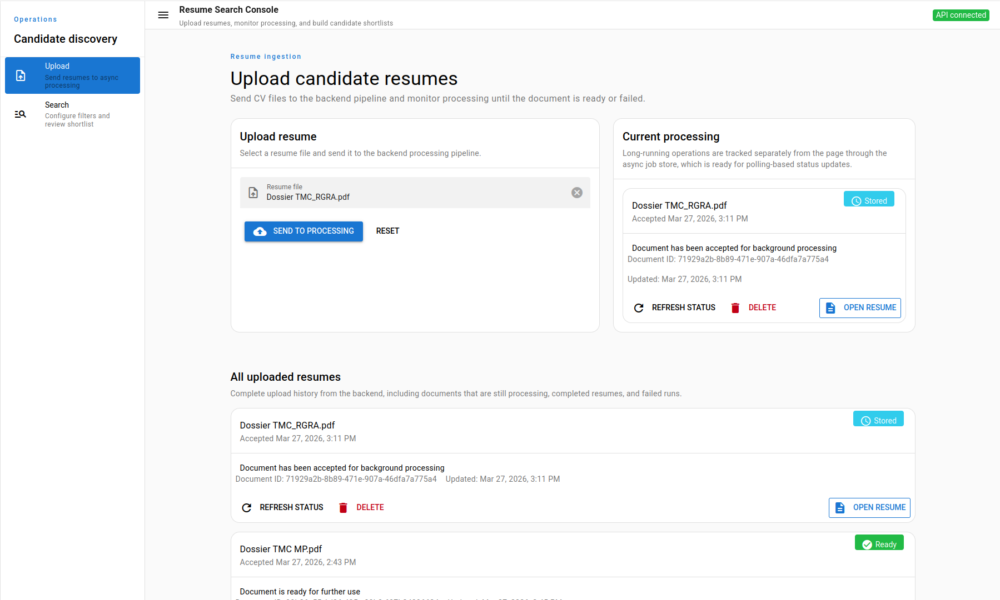
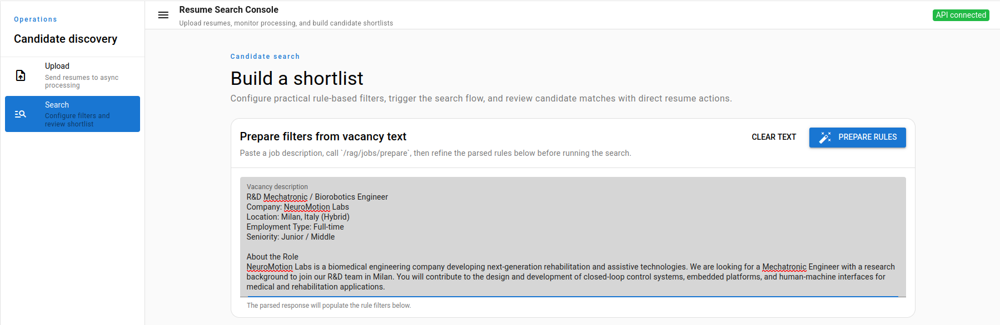
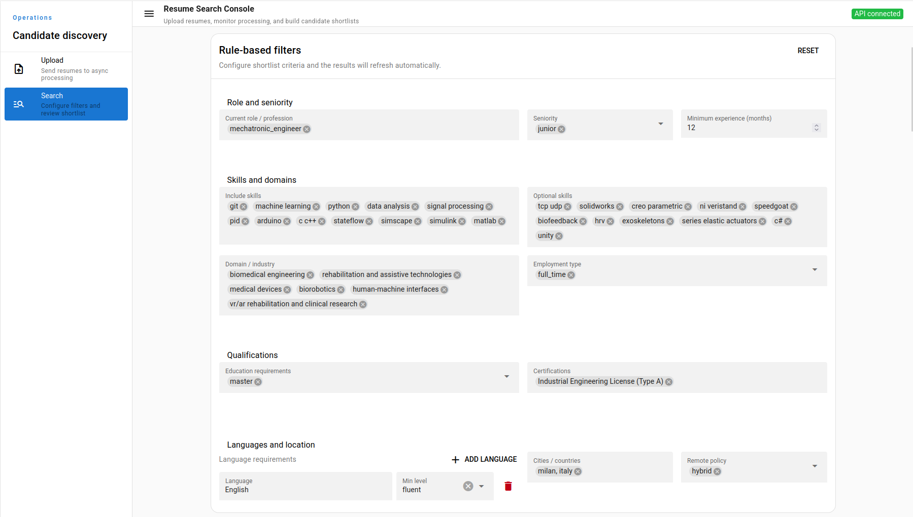
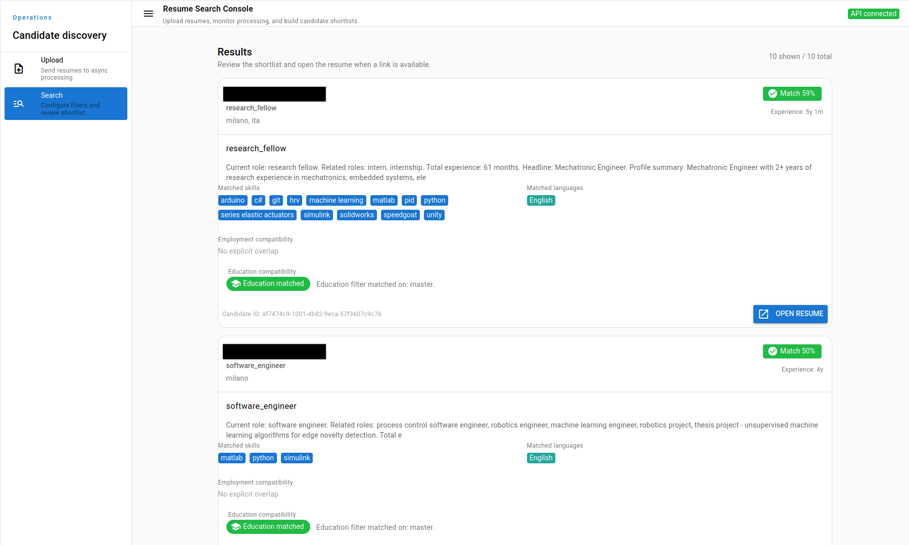

# CV Match AI 🚀



**CV Match AI** is a hackathon project built for **Hack4Innovation** to automate one of the most time-consuming recruiting tasks: selecting and prioritizing the most relevant candidates from a pool of CVs for a given job opening. 🤖

Instead of manually reading resumes one by one, the platform ingests CVs, extracts structured candidate data, builds semantic representations, and ranks candidates through a combination of rule-based and vector search. The result is a recruiter-facing workflow that is faster, more explainable, and easier to scale. ✨

## The Challenge 🎯

This project was created for the following challenge track from **TMC Italia S.p.A.**:

> Understand how to select and prioritize candidates from a pool of CVs who are potentially more suitable for a certain position. As of today, this is a manually conducted process, so the key goal is precisely to use AI for the purpose of automating the process.

The broader challenge context focused on using AI and digital technologies to improve operational efficiency and create new innovation opportunities in collaboration with universities.  
The solution direction was shaped around structured extraction, explainable ranking, and human-reviewable results, which are important traits for **AI Act-aware** hiring workflows. 🧠

## What We Built 🛠️

The project combines:

- **FastAPI** backend for ingestion, extraction, normalization, indexing, and search
- **Quasar SPA** frontend for upload, job preparation, and candidate review
- **PostgreSQL** as the source of truth for structured candidate and vacancy data
- **Qdrant** for semantic search over resume chunks
- **MinIO / S3-compatible storage** for uploaded CV files

## How It Works ⚙️

### 1. Upload CVs
Users upload a PDF or DOCX resume through the frontend. The system stores the original file and starts an asynchronous processing pipeline. 📄

### 2. Extract Candidate Entities
The backend extracts structured information such as:

- profile and current role
- work experience
- skills
- languages
- education
- certifications

### 3. Normalize and Index
The extracted data is normalized into consistent categories and transformed into semantic resume chunks, then embedded and indexed in Qdrant. 🧩

### 4. Prepare a Vacancy
Recruiters can paste a job description, and the system turns it into:

- structured search filters
- semantic search queries

### 5. Rank Candidates
Candidate ranking combines:

- **structured matching** from normalized entities
- **semantic similarity** from vector search
- **explainable scoring** for recruiter-friendly review

This helps avoid brittle exact-match search while still keeping the results interpretable. 📊

## Key Product Ideas 💡

- **Hybrid candidate search**: structured filters + semantic retrieval
- **Explainable ranking**: results are not just “found”, but also justified
- **Recall-first approach**: better to surface potentially relevant people than to over-filter too early
- **Human-in-the-loop UX**: recruiters can review filters and search output before making decisions

## Screenshots 🖼️

### 1. Upload CVs


### 2. Prepare Job Filters


### 3. Applied Filters


### 4. Search Results


## Quick Start ▶️

### Run with Docker Compose

```bash
docker compose up --build
```

Frontend:

```text
http://localhost:9001
```

Backend API docs:

```text
http://localhost:8000/docs
```

### Local Development

Backend:

```bash
uv sync
uv run python main.py
```

Frontend:

```bash
cd frontend
npm install
npm run dev
```

## Why This Project Matters ❤️

Recruiting teams often lose time on repetitive first-pass screening. CV Match AI shows how AI can support this process with:

- faster candidate triage
- better shortlist quality
- more consistent reasoning
- reusable structured candidate knowledge

The goal is not to replace human judgment, but to give recruiters a much stronger starting point. 🙌

## Hackathon Outcome 🏁

This repository captures the final state of the project after the hackathon: a working end-to-end prototype that demonstrates how AI can automate CV analysis and candidate prioritization for real recruiting use cases.

